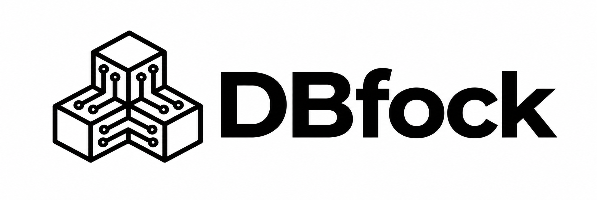

# DBfock

**A modern MySQL workspace for exploring schemas, querying data, and using AI with real database context.**

DBfock is a focused, lightweight alternative to traditional database IDEs. It brings MySQL connections, schema browsing, SQL editing, tabbed results, saved queries, auditability, and AI assistance into a clean workspace built for people who need to understand and operate databases every day.

Run it in the browser with Docker or local dev servers, or package it as a native desktop app with Wails.

## Why DBfock

- **Query data with less friction:** connect, browse schemas, open tables, and run SQL without leaving the workspace.
- **AI that understands your schema:** choose the database/table scope, then ask the agent to explain queries, improve SQL, or generate new statements with context.
- **Safer production work:** production connections hold pending changes until you explicitly commit or roll them back.
- **Persistent workflow:** tabs, history, saved queries, Smart Queries, and preferences are ready when you come back.
- **Local-first security:** connection passwords and AI keys are encrypted in the application store.
- **Easy migration:** import compatible MySQL connection metadata from DBeaver projects.

## Features

### Database Workspace

- Create, test, edit, import, and export MySQL connections.
- Assign connection colors and mark each connection as development or production.
- Browse connections, connection status, databases, and tables from the sidebar.
- Work in tabs for home, tables, SQL, stats, saved queries, Smart Queries, and settings.
- Use global search to jump across tabs, saved queries, Smart Queries, and settings.

### Schema Navigation

- List databases, tables, and views.
- Inspect table structure.
- View columns, indexes, constraints, foreign keys, references, triggers, and DDL.
- Open paginated table data in a grid.

### SQL Editor

- CodeMirror-powered SQL editor.
- Run SQL with `Ctrl/Cmd + Enter`.
- Run into a new result tab with `Ctrl/Cmd + \`.
- Query history.
- Multiple result tabs.
- Cancellable queries by request id.
- Row limits, pagination, and query timeouts.
- Export results as CSV, JSON, and TSV.
- Formatting, editor search, copy/paste actions, and productivity shortcuts.

### AI for SQL

- AI agent panel attached to SQL tabs.
- Providers: OpenAI, OpenRouter, Anthropic, and Ollama.
- Model selection from the configured provider.
- Optional use of the currently open editor query as context.
- Configurable schema scope: all databases/tables or a manual selection.
- Quick actions to explain SQL, improve SQL, and insert AI-generated SQL into the editor.
- Smart Queries generated from filtered SELECT statements, with editable parameters for reuse without hand-editing SQL.
- Local AI audit logs with the sent prompt, received response, execution stage, provider, and model.

### Operations and Security

- Connection passwords and API keys are encrypted with AES-GCM.
- Password values are not returned in API responses, exports, or logs.
- Schema identifiers are validated before SQL interpolation.
- Pagination values are parameterized.
- Payload size, returned rows, concurrency, MySQL pool sizes, and query timeouts are bounded.
- CORS allow-listing, rate limiting, and consistent error responses.

### Customization

- Interface available in English and Brazilian Portuguese.
- Themes for GitHub, VS Code, One Dark, Dracula, Cobalt2, Claude Code, Codex, and Monokai.
- Text scale controls.
- Keyboard shortcut reference in settings.

## How It Works

```text
Nuxt 4 / Vue 3 / TypeScript
        | REST
Go + Chi API -- provider registry -- MySQL (`database/sql`)
        |
Local SQLite application store

Wails v2 packages the Nuxt build and starts the local Go API inside the desktop app.
```

- **Backend:** Go 1.24, Chi, `database/sql`, `github.com/go-sql-driver/mysql`, SQLite through `modernc.org/sqlite`, and Wails v2.
- **Frontend:** Nuxt 4.4, Vue 3 Composition API, Pinia, Tailwind CSS, and CodeMirror.
- **Provider boundary:** the `database.Provider` interface separates schema discovery, data reads, and query execution. MySQL is implemented today; additional database engines can be added behind the same HTTP contract.
- **Local SQLite:** stores DBfock metadata only, such as connections, preferences, history, and audit logs. It does not replace or mix with the MySQL databases you manage.

## Project Structure

```text
backend/
  cmd/api/                 Browser/API entrypoint
  internal/                API, config, providers, repository, AI, and middleware
  migrations/              SQLite application migrations
  main.go                  Wails desktop entrypoint
  wails.json               Desktop app configuration

frontend/
  app/components/          Workspace, SQL editor, data grid, AI, settings, and tree
  app/pages/               Main screen
  app/stores/              Workspace state
  app/utils/               DBeaver import and result export helpers
  public/branding/         Brand icons and assets

docker-compose.yml         Web stack with frontend and backend
Makefile                   Common development commands
banner.png                 README banner
```

## Run with Docker

Requirements: Docker, Docker Compose, and a reachable MySQL server.

```bash
cp .env.example .env
# Set ENCRYPTION_KEY in .env before storing real credentials.
docker compose up --build
```

Open [http://localhost:3000](http://localhost:3000). The API health endpoint is available at [http://localhost:8080/health](http://localhost:8080/health).

Docker Compose starts DBfock only. Add a connection inside the UI for the MySQL server you want to manage.

## Run Locally

Requirements: Go 1.24+, Node.js 24+, npm, and a reachable MySQL server.

```bash
cp .env.example .env
cd backend && ENCRYPTION_KEY=local-development-key go run ./cmd/api

# In another terminal
cd frontend && npm install && npm run dev
```

Open [http://localhost:3000](http://localhost:3000).

## Desktop App

For live-reload desktop development:

```bash
make dev-desktop
```

To build the app:

```bash
make build-desktop
```

On macOS, the generated app is written under `backend/build/bin/`. The desktop app keeps its SQLite database and generated encryption key in the OS user configuration directory under `DBfock`.

### macOS Gatekeeper

Release builds are ad-hoc signed, but they are not notarized with an Apple Developer ID yet. If macOS shows **"DBfock is damaged and can't be opened"** after downloading the ZIP from GitHub, remove the quarantine attribute:

```bash
xattr -dr com.apple.quarantine /Applications/DBfock.app
```

Then open DBfock again. If you kept the app somewhere else, replace `/Applications/DBfock.app` with that path.

## First Steps

1. Click **Create connection**.
2. Enter host, port, username, password, initial database, and environment.
3. Use **Test connection** before saving.
4. Connect, expand the sidebar tree, and open a table.
5. Use **New SQL query** to execute statements.
6. Save recurring SQL or create Smart Queries from filtered SELECT statements.
7. Configure AI in **Settings -> AI agent** to explain, improve, and generate SQL with schema context.

## Useful Commands

| Command | Description |
| --- | --- |
| `make dev-backend` | Start only the Go API. |
| `make dev-frontend` | Start only the Nuxt app. |
| `make dev-desktop` | Open the Wails app with live reload. |
| `make test` | Run the Go test suite. |
| `make typecheck` | Run Nuxt/TypeScript checks. |
| `make build` | Build the web API and frontend. |
| `make build-desktop` | Build the native desktop app. |
| `make docker-up` | Start the web stack with Docker Compose. |

## API Highlights

- `GET /health`
- `GET|POST /api/connections`
- `GET|PUT|DELETE /api/connections/:id`
- `POST /api/connections/test`
- `GET /api/connections/export`
- `POST /api/connections/import`
- `POST /api/connections/:id/connect`
- `GET /api/connections/:id/databases`
- `GET /api/connections/:id/databases/:database/tables`
- `GET /api/connections/:id/databases/:database/tables/:table/structure`
- `GET /api/connections/:id/databases/:database/tables/:table/data`
- `POST /api/connections/:id/query`
- `POST /api/connections/:id/query/cancel`
- `GET|PUT /api/ai/settings`
- `POST /api/ai/models`
- `POST /api/ai/chat/jobs`
- `GET /api/ai/chat/jobs/:id`
- `POST /api/ai/smart-queries`
- `GET /api/ai/audit-logs`

## License

DBfock is released under the [MIT License](./LICENSE).
