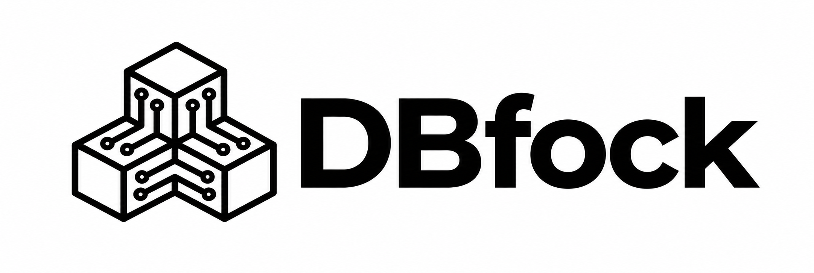
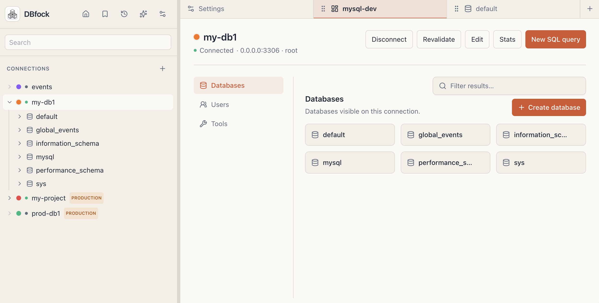

# DBfock

A modern MySQL workspace for browsing schemas, running SQL, and using AI with real database context.



## Install the desktop app

macOS and Linux:

```bash
curl -fsSL https://raw.githubusercontent.com/alexclaz/dbfock/main/install.sh | bash
```

The installer builds DBfock locally and installs it in `/Applications` on macOS or `~/.local` on Linux. It asks before installing missing dependencies. For a non-interactive install, use:

```bash
curl -fsSL https://raw.githubusercontent.com/alexclaz/dbfock/main/install.sh | DBFOCK_YES=1 bash
```

### Prebuilt downloads

Windows and Linux builds are published on the [releases page](https://github.com/alexclaz/dbfock/releases/latest):

- **Windows (x64):** run `dbfock_<version>_windows_amd64_setup.exe`, or unzip `dbfock_<version>_windows_amd64.zip` for a portable build. WebView2 is bundled.
- **Linux (x64):** unpack `dbfock_<version>_linux_amd64.tar.gz` and run `./install.sh` to install into `~/.local`. Requires GTK 3 and WebKit2GTK 4.1.

Each asset ships a `.sha256` file next to it.

## What it does

- Manage MySQL connections, including import from DBeaver and encrypted local credentials.
- Browse databases, tables, columns, indexes, constraints, triggers, DDL, and data.
- Work with persistent tabs, saved queries, query history, result tabs, CSV/JSON/TSV export, and Smart Queries.
- Use a CodeMirror SQL editor with search, formatting, keyboard shortcuts, and cancellable queries.
- Keep production changes pending until they are explicitly committed or rolled back.
- Ask OpenAI, OpenRouter, Anthropic, or Ollama to explain, improve, and generate SQL using selected schema context.
- Back up and restore the local workspace to S3-compatible storage.

## Run in the browser

### Docker

Requires Docker, Docker Compose, and a reachable MySQL server.

```bash
cp .env.example .env
docker compose up --build
```

Open [http://localhost:13000](http://localhost:13000). Set `ENCRYPTION_KEY` in `.env` before storing real credentials.

### Local development

Requires Go 1.24+, Node.js 24+, npm, and a reachable MySQL server.

```bash
cp .env.example .env
cd backend && ENCRYPTION_KEY=local-development-key go run ./cmd/api

# In another terminal
cd frontend && npm install && npm run dev
```

Open [http://localhost:13000](http://localhost:13000).

## Desktop development

```bash
make dev-desktop     # Wails with live reload
make build-desktop   # native build
```

If you already have a checkout, install it with `make install-desktop` (macOS) or `make install-linux` (Linux).

When a newer version exists, the web version shows a notification. The Wails app also offers **Update now**, opening the official releases page; installation remains an explicit user action.

## Architecture

- **Frontend:** Nuxt 4, Vue 3, TypeScript, Pinia, Tailwind CSS, and CodeMirror.
- **Backend:** Go, Chi, `database/sql`, MySQL, SQLite, and Wails v2.
- **Local data:** SQLite stores DBfock metadata, preferences, history, and encrypted secrets; it never replaces the MySQL databases you manage.

## Common commands

| Command | Description |
| --- | --- |
| `make dev-backend` | Start the Go API. |
| `make dev-frontend` | Start the Nuxt app. |
| `make dev-desktop` | Start the Wails app. |
| `make test` | Run backend tests. |
| `make typecheck` | Run frontend type checks. |
| `make docker-up` | Start Docker Compose. |

## License

[MIT](./LICENSE)
